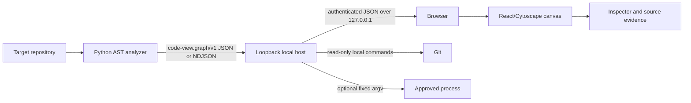

# Code View technical details

This document describes the local runtime for contributors and operators who
need to understand the service boundary, graph contract, security model, and
verification commands.

## 1. Scope and non-goals

The current producer is a static Python analyzer. Code View is a macOS,
localhost-only application with a read-only browser canvas. It does not provide
a cloud backend, accounts, telemetry, remote repository access, or a runtime
Python execution model.

Java and Go are future producers. They can target the same versioned graph
envelope without requiring a different browser model.

## 2. System architecture



The browser never reads repository files directly. It asks the host for graph,
source, Git, and launch data. The host pins the repository root and web asset
root when it starts.

## 3. Service boundaries

| Service | Responsibility |
| --- | --- |
| `services/python-analyzer` | Deterministic Python AST parsing, entry detection, relationship emission, diagnostics, JSON/NDJSON output. |
| `services/local-server` | Qt 6.8+ C++20 loopback HTTP, secure repository reads, graph import, generation lifecycle, watching, Git, fixed editor adapters, and launch guards. |
| `services/web-canvas` | React/TypeScript presentation, filters, flow layout, selection, Inspector, search, tabs, bookmarks, saved views, exports, themes, and responsive controls. |
| `contracts` | Versioned configuration, graph, and launch-approval schemas. |

The analyzer and host communicate through the graph contract. The canvas adapter
in `services/web-canvas/src/apiContract.ts` is the only place that translates
the host envelope into browser types.

## 4. Startup and request flow

1. `script/code-view.sh` installs locked npm dependencies when needed.
2. The script builds the canvas and the native host.
3. `code-view-local-server` validates the repository and configuration.
4. The host starts the analyzer with program-plus-argv, never through a shell.
5. A complete graph is imported and semantically validated.
6. The host listens on `127.0.0.1` and prints a tokenized startup URL.
7. The browser bootstraps with that URL and retains the bearer token in
   tab-scoped session storage.
8. Every API request carries the bearer token and is checked at the host.
9. The browser polls status and loads graph/source/evidence data as needed.

The default port is `0`, so the operating system chooses an available loopback
port. `--port N` requests a fixed port.

## 5. Configuration contract

The strict schema is
[`contracts/code-view-config-v1.schema.json`](../contracts/code-view-config-v1.schema.json).
Supported top-level keys are `schemaVersion`, `entry`, `startCommand`,
`languages`, `includeTests`, `index`, `canvas`, and `git`.

Configuration precedence:

```text
entry.file/symbol
  > accepted startCommand entry hint
  > automatic entry detection
```

For test inclusion:

```text
index.tests
  > includeTests shorthand
```

`languages` must currently be exactly `["python"]`. `entry` is a file string or
an object with `file`, optional `symbol`, and optional command metadata.
`startCommand` is a string or an object with `argv` and `mode`. Only an object
with `mode: "manual"` is executable; strings remain documentation and entry
hints.

`index.tests` is `exclude` or `include`; `index.modules` is `hide` or `show`;
`externalPackages` is currently `collapse`; `index.exclude` is a list of
repository-relative glob patterns. `canvas.initialView` is `entry-focus` or
`whole-repo`. Relationship configuration accepts an enabled-name array or a
boolean object. `git.base` selects the default comparison ref.

Unknown keys, invalid enum values, unsafe paths, and explicit null values where
the schema does not allow them are rejected before analysis.

## 6. Graph contract

The versioned envelope is `code-view.graph/v1`, defined by
[`contracts/code-view-graph-v1.schema.json`](../contracts/code-view-graph-v1.schema.json)
and explained in [`contracts/code-view-graph-v1.md`](../contracts/code-view-graph-v1.md).

Node identity includes language, kind, qualified name, and repository-relative
path. Repeated definitions receive deterministic source-order suffixes. Edge
identity includes relationship kind, endpoints, and occurrence range.

Nodes carry kind, language, name, qualified name, path, source range, signature,
docstring/summary, resolution flags, reason, and modifiers. Edges carry kind,
source, target, path/range, reason, resolution, confidence, occurrence count,
locations, and comparison data where available.

Ranges use one-based UTF-8 line and column positions; end positions are
exclusive. Relationship direction is consumer to dependency except `contains`,
which points from owner to child, and `decorates`, which points from decorated
symbol to decorator.

Supported relationships are `contains`, `imports`, `calls`, `inherits`,
`constructs`, `reads`, `writes`, `decorates`, `type_uses`, `api_calls`, and
`test_covers`.

`external` means a target is known but outside the repository. `unresolved`
means static analysis cannot safely name a target. Both require a non-empty
reason. The importer rejects duplicate IDs, dangling endpoints, reversed ranges,
unknown entry IDs, and malformed boundary nodes.

NDJSON is deterministic and ordered as meta, sorted nodes, sorted edges, sorted
diagnostics, then summary.

## 7. Python analyzer

`services/python-analyzer/analyzer.py` uses Python's standard-library `ast`,
filesystem, and tokenization modules. It:

- discovers `.py` files without following symlinks;
- excludes VCS directories, virtual environments, caches, dependency folders,
  and tests by default;
- resolves common imports, aliases, calls, constructors, inheritance, reads,
  writes, decorators, annotations, and API boundaries;
- emits deterministic node and edge IDs;
- records syntax and resolution diagnostics; and
- never imports or executes the target repository.

Useful direct invocations:

```sh
python3 services/python-analyzer/analyzer.py /absolute/path/to/repository
python3 services/python-analyzer/analyzer.py /absolute/path/to/repository --format ndjson --trace
python3 services/python-analyzer/analyzer.py /absolute/path/to/repository --include-tests
```

Static analysis cannot prove runtime-only behavior such as reflection, dynamic
imports, monkey patching, and unknown receiver dispatch. Those cases remain
external or unresolved boundaries with reasons instead of invented internal
edges.

## 8. Entry reachability

The analyzer resolves an explicit entry first, then accepted command metadata,
root `main.py`, a unique `__main__.py`, and finally a unique top-level main
guard. It records `entryNodeId` and `entryReachableNodeIds` in the project
metadata. The host's `entry` graph view includes reachable nodes, containment
ancestors, and edges whose endpoints are selected.

## 9. Indexing and generation lifecycle

1. Configuration and repository paths are validated.
2. The analyzer runs with a bounded deadline.
3. Output is capped, parsed, and semantically validated.
4. A complete valid graph becomes the next immutable generation.
5. The browser polls `/api/v1/status`.
6. The watcher combines filesystem hints with a deterministic manifest scan.
7. Changes are debounced and the latest reindex wins.
8. A failure retains the last good graph and reports `lastError`.
9. A syntax-error replacement retains prior facts as stale where possible.
10. Fixing the source creates a new successful generation.

The browser reports same-generation errors too. A failed reindex cannot make a
previous command approval executable again.

## 10. Browser presentation model

The canvas keeps canonical graph facts separate from presentation elements.
`Repository` is the complete filtered graph. `Entry Focus` is the complete
reachable graph. `All connections` shows the current filtered graph, while
`Selected flow` creates three lanes: inbound callers, the selected symbol and
owned rows, and outbound dependencies.

File/class headers are visual ownership boundaries. Function-local rows are
flat and owner-qualified. Edges terminate at leaf symbol rows, not at compound
containers, and Cytoscape's preset layout plus taxi routing is motion-free and
deterministic. Dense views remain pannable and zoomable.

The browser preserves canonical IDs and locations in selection, Inspector,
Trace, and JSON export. An occurrence request is guarded by the current
selection and request revision so an old response cannot replace newer evidence.

## 11. Security boundary

- TCP binds to `127.0.0.1` only.
- Requests must come from a loopback peer.
- `Host` must match the selected loopback port.
- A supplied `Origin` must match the loopback origin.
- API routes require the bearer token bootstrapped by the startup URL.
- Responses use same-origin CSP, `Cache-Control: no-store`, `nosniff`,
  `no-referrer`, same-origin resource policy, and `X-Frame-Options: DENY`.
- Repository paths are normalized, contained, and opened relative to pinned
  directory descriptors.
- Symlink components and non-regular source files are rejected.
- Static assets are read only below the pinned web root.
- Default analyzer and Git executables use trusted absolute paths.
- Git disables hooks, prompts, external diff, optional locks, and inherited
  path overrides.
- Analyzer, Git, editor, and launch processes use program-plus-argv; no shell
  parses request or configuration data.

The browser cannot select an executable or append launch arguments. These
controls protect the host boundary; they do not make an approved project
command safe.

## 12. Optional process execution

The launch approval schema is
[`contracts/code-view-launch-approval-v2.schema.json`](../contracts/code-view-launch-approval-v2.schema.json).
Execution requires manual command mode, the `--allow-command` host flag, and a
fresh UI approval bound to the displayed generation. The exact approval body is:

```json
{
  "schemaVersion": "code-view.launch-approval/v2",
  "generation": 1
}
```

Approval is consumed by one start. A reindex, generation change, or failed
index invalidates it. Stop remains available for a process that is already
running. The host owns the process group and discovered descendants for
cleanup. This is lifecycle management, not a sandbox. Approved programs may
read, modify, or delete accessible files and use the network.

## 13. Git comparison

The host reads local branches and recent commits, archives a selected base into
a temporary directory, and analyzes it without checkout or repository mutation.
The browser overlays `WORKTREE` against the selected base and exposes bounded
source diffs for changed nodes. A repository without a usable Git `HEAD` still
loads; comparison simply has no evidence.

## 14. Resource limits and performance

| Resource | Limit |
| --- | ---: |
| One graph record | 1 MB |
| Analyzer output | 100 MB |
| Nodes | 500,000 |
| Edges | 2,000,000 |
| Request body | 4 KB |
| Source response | 5 MB or 400 lines |
| Static asset | 10 MB |
| Git process output | 2 MB |
| Base archive | 512 MB |
| Startup, watched, or Git snapshot analysis | 120 seconds |
| Bounded graph depth | 0 to 8 |
| Bounded graph neighbor limit | 1 to 1,000 |

The 10,000-Python-source-line envelope is a performance benchmark, not a hard
repository-size rejection. The performance evaluator measures cold analysis and
native adjacency queries on standard and import-heavy 10,000-line shapes.

## 15. Failure and recovery behavior

- Invalid configuration fails before analysis and explains the field.
- Invalid Python produces diagnostics and preserves the last usable graph.
- Invalid graph shape or semantic data is rejected before publication.
- A failed reindex keeps the previous generation readable and displays its
  error even when the generation number is unchanged.
- Command approval and start are blocked while indexing is active or failed.
- A repaired graph receives a new generation and requires fresh approval.
- Unresolved and external targets remain visible with reasons.
- Source, Git, and editor failures are reported as bounded JSON errors.

## 16. API route summary

All API routes are under `/api/v1` and require the bearer token.

| Method and route | Purpose |
| --- | --- |
| `GET /project` | Project metadata and counts. |
| `GET /status` | Generation, state, diagnostics, and last error. |
| `GET /graph?view=repository\|entry` | Complete repository or entry graph. |
| `GET /graph?root=...` | Bounded depth/direction graph. |
| `GET /node?id=...` | Canonical node and paged neighbors. |
| `GET /search?q=...` | Bounded symbol search. |
| `GET /source?path=...` | Bounded read-only source range. |
| `GET /git/refs` | Local branches and recent commits. |
| `GET /git/revision?ref=...` | Local commit and worktree state. |
| `GET /compare?base=...&target=WORKTREE` | File, node, and edge comparison. |
| `GET /git/diff?node=...&base=...` | Changed-symbol diff evidence. |
| `POST /reindex` | Request a watched reindex. |
| `GET /launch` | Configured command status. |
| `POST /launch/approve` | Approve one displayed generation. |
| `POST /launch/start` | Consume approval and start. |
| `POST /launch/stop` | Stop an owned process. |
| `POST /editor/open` | Use the fixed editor adapter. |

## 17. Build and verification

The shortest complete build is:

```sh
./script/code-view.sh /absolute/path/to/repository
```

The repository stores its user-facing PNG captures with Git LFS. Git LFS is not
needed to run the application, but it is needed to materialize those captures
after a clone.

Manual web build:

```sh
npm ci --prefix services/web-canvas
npm run build --prefix services/web-canvas
```

Manual native build:

```sh
cmake -S services/local-server -B services/local-server/build -G Ninja \
  -DCMAKE_PREFIX_PATH=/opt/homebrew/opt/qt -DBUILD_TESTING=ON
cmake --build services/local-server/build
```

Run the host directly after building:

```sh
./services/local-server/build/code-view-local-server \
  --repo /absolute/path/to/repository \
  --web-root services/web-canvas/dist
```

Fast gate:

```sh
./script/code-view-gate.sh
```

Periodic suite:

```sh
./script/code-view-eval.sh
```

Individual checks:

```sh
python3 -m unittest discover -s services/python-analyzer -p 'test_*.py'
python3 evals/python-analyzer/evaluate.py
npm test --prefix services/web-canvas
npm run eval --prefix services/web-canvas
ctest --test-dir services/local-server/build --output-on-failure
```

## 18. Adding another language

Add a producer that emits `code-view.graph/v1`, validates its own semantic
facts, and preserves one-based source ranges, stable IDs, boundary reasons, and
entry reachability. Keep language-specific parsing inside the producer. The
host importer, HTTP routes, canvas filters, Inspector, and export model should
continue to depend only on the versioned contract.

## 19. Known static-analysis limits

Static analysis is intentionally honest rather than speculative. Runtime
dispatch, reflection, monkey patching, dynamic imports, and unknown receiver
types may end at unresolved boundaries. A boundary reason is evidence that the
analyzer stopped safely, not a claim that the runtime target does not exist.
